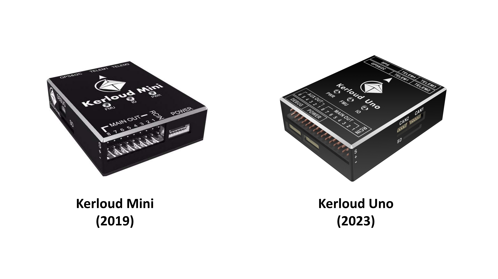
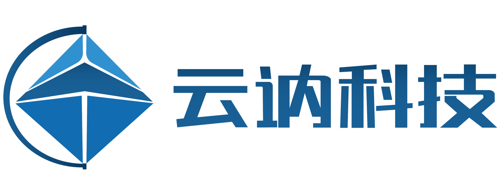
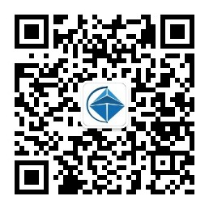

# Welcome to Kerloud Autopilot Website!

## Motivation

Open source innovation has become an inevitable trend in many fields not limited within software for decades, and it is disrupting the 
ideology how we invent new products and validate business values. The PX4 and Ardupilot communities have benefited millions of drone developers and 
users around the world. What we deemed impossible in flight control ten years ago can be easily achieved with open source software and hardware.

Therefore, we embrace this trend to build our products by standing on the shoulder of giants instead of sole in-house development. Kerloud autopilots
are stable solutions that enable autonomous flights for unmanned aerial vehicles, and they can also be extended to support other robots such as rovers and even flying 
cars. The autopilots are designed to meet both software and hardware standards from the PX4 community, and full compatibility is ensured for both PX4 and Ardupilot software. 

Kerloud autopilots are presented by Cloudkernel Technologies (Shenzhen) Co., Ltd with long-term support.

## About Us

Cloudkernel Technologies (Shenzhen) is a technology-driven company geared towards science and technology education in robotics. We offer the following main products and services:

* Education products and courses, including unmanned aerial vehicles (UAV), unmanned ground vehicles (UGV), unmanned flying rovers (UFR) and AI education.

* Industry solutions such as UAV autopilot, self-driving software suite.

Other products can be found in the following links:

- Kerloud UAV series: <https://kerlouduav.readthedocs.io>
- Kerloud flying rover series: <https://kerloud-flyingrover.readthedocs.io>
- Kerloud VTOL products: <https://kerloud-vtol.readthedocs.io>
- Kerloud autocar series: <https://kerloud-autocar.readthedocs.io>
- Kerloud DASA (Dynamic Autonomous System Arena): <https://kerloud-dasa.readthedocs.io>

Our main webpage is <https://cloudkernel-tech.github.io>, and you may contact us by email: <cloudkerneltech@gmail.com>. 
Wechat users can scan the QR code below to follow our official account:

## 目标

开源创新在过去数十年已经成为不可避免的趋势，影响不仅限于软件领域。它正在颠覆我们创新产品和验证商业价值的理念。PX4和Ardupilot的社区已让全球数百万的开发者和用户受益。
十年前我们认为飞行控制中不可实现的事情如今可以很容易地通过开源软硬件实现。

所以，我们积极拥护这个潮流，选择站在巨人肩膀上创造产品，而不是闭门造车。Kerloud自驾仪是稳定的飞行控制器方案，可以方便地实现无人机的自主飞行，也可以拓展应用到其他机器人，包括无人车甚至飞行汽车。
自驾仪的设计遵循PX4社区的软件和硬件标准，并可同时兼容PX4和Ardupilot的软件。

Kerloud自驾仪由云讷科技(深圳)有限公司提供,并会被长期支持。

## 关于我们

云讷科技（深圳）有限公司是一家机器人科技教育公司，我们提供下述产品和服务：

- 提供基于无人系统技术的教育产品和课程：包括无人机，无人车，无人飞车和人工智能教育

- 提供部分行业核心解决方案，如无人机飞行控制器，无人驾驶软件方案等

其他产品可以在下述链接找到：

- Kerloud 无人机系列: <https://kerlouduav.readthedocs.io>
- Kerloud 无人飞车系列: <https://kerloud-flyingrover.readthedocs.io>
- Kerloud 垂直起降固定翼产品: <https://kerloud-vtol.readthedocs.io>
- Kerloud 无人车系列: <https://kerloud-autocar.readthedocs.io>
- Kerloud DASA (Dynamic Autonomous System Arena) 机器人赛场: <https://kerloud-dasa.readthedocs.io>

我们的主页是 <https://cloudkernel-tech.github.io> , 你可以通过邮件 <cloudkerneltech@gmail.com> 联系到我们。
微信用户可以扫描下面的二维码关注我们的公众号：

